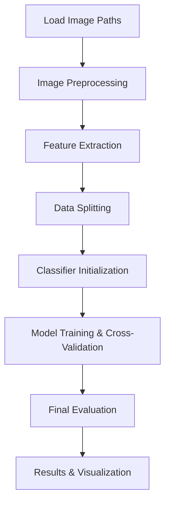

# Train Features Flow - Detailed Technical Documentation

## Overview
The `train_features` function implements a comprehensive machine learning pipeline for skin lesion classification using conventional feature engineering. This document explains each step in detail, from image preprocessing to model evaluation.

---

## 🔄 **Complete Pipeline Flow**



---

## 📁 **Step 1: Data Loading & Dataset Preparation**

### **Image Path Collection**
```python
# Load image paths from specified directories
bcc_paths = glob.glob(os.path.join(args.bcc_dir, "*.jpg")) + \
            glob.glob(os.path.join(args.bcc_dir, "*.png")) + \
            glob.glob(os.path.join(args.bcc_dir, "*.jpeg"))

sk_paths = glob.glob(os.path.join(args.sk_dir, "*.jpg")) + \
           glob.glob(os.path.join(args.sk_dir, "*.png")) + \
           glob.glob(os.path.join(args.sk_dir, "*.jpeg"))
```

### **Dataset Balancing**
```python
# Balance dataset to prevent class imbalance
if args.max_images_per_class > 0:
    random.shuffle(bcc_paths)
    random.shuffle(sk_paths)
    bcc_paths = bcc_paths[:min(len(bcc_paths), args.max_images_per_class)]
    sk_paths = sk_paths[:min(len(sk_paths), args.max_images_per_class)]
```

### **Label Creation**
```python
# Create binary labels (1 = BCC, 0 = SK)
bcc_labels = np.ones(len(bcc_paths), dtype=np.int32)
sk_labels = np.zeros(len(sk_paths), dtype=np.int32)
all_labels = np.concatenate([bcc_labels, sk_labels]).astype(np.int32)
```

---

## 🖼️ **Step 2: Image Preprocessing Pipeline**

### **2.1 Image Loading with Transparency Support**
```python
def load_image_with_transparency_support(image_path):
    """Load PNG with transparency, convert transparent areas to white background."""
    pil_image = Image.open(image_path)
    
    if pil_image.mode == 'RGBA':
        # Create white background for transparent areas
        background = Image.new('RGB', pil_image.size, (255, 255, 255))
        background.paste(pil_image, mask=pil_image.split()[-1])
        return np.array(background)
```

### **2.2 Hair Detection & Removal**
```python
# Step 1: Convert to grayscale for hair detection
grayscale_image = segmenter.convert_to_grayscale(original_image)

# Step 2: Apply combined hair detection (blackhat + tophat morphology)
combined_hair_mask, blackhat_image, tophat_image = segmenter.apply_combined_hair_detection(grayscale_image)

# Step 3: Apply inpainting to remove detected hairs
inpainted_image = segmenter.apply_inpainting(original_image, combined_hair_mask)
```

**Hair Detection Techniques:**
- **Blackhat Transform**: Detects dark linear structures (dark hairs)
- **Tophat Transform**: Detects bright linear structures (light hairs)
- **Morphological Operations**: Uses linear structuring elements to identify hair-like patterns
- **Inpainting**: Fills detected hair regions using surrounding pixel information

### **2.3 Image Smoothing**
```python
# Step 4: Apply Gaussian blur for noise reduction
image = segmenter.apply_gaussian_blur(inpainted_image)
```

### **2.4 Lesion Mask Generation**
```python
def generate_lesion_mask_from_transparent_background(image, threshold=10):
    """Generate binary mask separating lesion from background."""
    if image.shape[2] == 4:  # RGBA
        alpha_channel = image[:, :, 3]
        mask = alpha_channel > threshold
    else:  # RGB with white background
        gray = cv2.cvtColor(image, cv2.COLOR_RGB2GRAY)
        mask = gray < (255 - threshold)  # Non-white pixels = lesion
        
        # Morphological cleanup
        mask = opening(mask, disk(2))      # Remove noise
        mask = closing(mask, disk(3))      # Fill holes
        mask = remove_small_objects(mask, min_size=100)  # Remove artifacts
    
    return mask.astype(bool)
```

---

## 🔬 **Step 3: Feature Extraction**

### **3.1 Feature Extractor Initialization**
```python
feature_extractor = ConventionalFeatureExtractor()
```

### **3.2 Feature Categories Extracted**

#### **A. Color Features**
```python
# RGB Color Statistics
- RGB mean, std, skewness, kurtosis for each channel
- RGB ratios (R/G, R/B, G/B)
- RGB energy and entropy

# HSV Color Features  
- HSV mean, std, skewness, kurtosis for each channel
- Hue histogram features (8 bins)
- Saturation and Value distributions

# LAB Color Features
- LAB mean, std, skewness, kurtosis
- A* and B* channel statistics for color opponent information

# Color Moments
- First moment (mean), Second moment (variance), Third moment (skewness)
```

#### **B. Texture Features**
```python
# Gray-Level Co-occurrence Matrix (GLCM)
- Contrast: Measure of local intensity variation
- Dissimilarity: Average |i-j| over the GLCM
- Homogeneity: Measure of closeness of GLCM elements to diagonal
- Energy: Sum of squared GLCM elements (uniformity)
- Correlation: Measure of how pixel pairs are correlated
- ASM (Angular Second Moment): Measure of textural uniformity

# Local Binary Pattern (LBP)
- LBP histogram (uniform patterns)
- LBP variance for rotation invariance
- Measures local texture patterns around each pixel

# Wavelet Transform Features (NEW)
- 2D wavelet decomposition using Daubechies wavelets
- Approximation coefficients: mean, std, energy
- Detail coefficients: horizontal, vertical, diagonal
- Multi-level decomposition for scale analysis

# Gradient Features (NEW)
- Sobel gradient magnitude and direction
- Gradient statistical properties: mean, std
- Gradient direction histograms (8-bin orientation)
- Edge strength and directionality analysis

# Multi-scale Gabor Filters (Enhanced)
- Multiple orientations (0°, 45°, 90°, 135°)
- Multiple frequencies (0.1, 0.2, 0.3) optimized for skin lesions
- Multiple standard deviations (σ=3, σ=5)
- Statistical features: mean, std, energy, entropy, 99th percentile
- Optimized for BCC vs SK texture discrimination
```

#### **C. Shape & Morphological Features**
```python
# Basic Shape Metrics
- Area: Number of lesion pixels
- Perimeter: Boundary length
- Compactness: 4π×Area/Perimeter²
- Eccentricity: Measure of elongation
- Solidity: Area/Convex_Hull_Area
- Extent: Area/Bounding_Rectangle_Area

# Advanced Shape Features
- Major/Minor axis lengths
- Orientation angle
- Circularity measures
- Rectangularity
- Aspect ratio
- Form factor
```

#### **D. ABCDE Rule Features**
```python
# A - ASYMMETRY (Enhanced multi-directional analysis)
- Horizontal asymmetry: Left vs right half comparison
- Vertical asymmetry: Top vs bottom half comparison
- Asymmetry quantification using center of mass

# B - BORDER IRREGULARITY (Advanced border analysis)
- Border fractal dimension using box counting method
- Border curvature variance analysis
- Multi-scale border irregularity measurement
- Border smoothness and roughness quantification

# C - COLOR VARIATION (Stable variance-based analysis)
- Dominant colors count using variance thresholding
- Color entropy in RGB and HSV spaces
- Color uniformity coefficient calculation
- Color distribution variance analysis

# D - DIAMETER-related features
- Equivalent diameter from lesion area
- Major and minor axis lengths
- Axis ratio for elongation measurement
- Size-based morphological characteristics
```

#### **E. Enhanced Color Features**
```python
# Color Moments (More robust than basic statistics)
- Central moments (1st through 4th order) for RGB, HSV, LAB
- Moment-based shape descriptors for color distributions
- Statistical robustness against outliers

# Percentile-based Features (Robust statistics)
- 10th, 25th, 75th, 90th percentiles for each color channel
- Interquartile range (IQR) for distribution spread
- Outlier-resistant color characterization

# Dermatological Color Ratios (BCC vs SK discrimination)
- Red/Green/Blue intensity ratios
- Normalized color component analysis
- Cross-channel ratios: R/G, R/B, G/B
- Total intensity normalization for lighting independence

# Advanced Color Space Analysis
- Multi-space color moments across RGB, HSV, LAB
- Color space transformation robustness
- Illumination-invariant color features
```

### **3.3 Feature Extraction Process**
```python
for idx, image_path in enumerate(all_image_paths):
    try:
        # Load and preprocess image
        original_image = load_image_with_transparency_support(image_path)
        processed_image = apply_hair_removal_and_smoothing(original_image)
        
        # Generate lesion mask
        mask = generate_lesion_mask_from_transparent_background(processed_image)
        
        # Extract all features
        features = feature_extractor.extract_all_features(processed_image, mask)
        
        # Feature breakdown (as implemented in ConventionalFeatureExtractor):
        # 1. Geometric features: shape, border, asymmetry analysis
        # 2. Color features: RGB, HSV, LAB statistics and distributions  
        # 3. Texture features: GLCM, LBP, wavelets, gradients, Gabor filters
        # 4. ABCDE features: asymmetry, border, color, diameter analysis
        # 5. Enhanced color features: moments, percentiles, ratios
        
        features_list.append(features)
        
    except Exception as e:
        logger.error(f"Error processing {image_path}: {str(e)}")
        features_list.append({})  # Empty dict to maintain alignment
```

### **3.4 Feature Matrix Construction**
```python
# Handle features that return arrays/lists
expanded_feature_keys = []

for features in features_list:
    for key, value in features.items():
        if isinstance(value, (list, np.ndarray)):
            # Create individual features for each array element
            for i in range(len(value)):
                expanded_key = f"{key}_{i}"
                if expanded_key not in expanded_feature_keys:
                    expanded_feature_keys.append(expanded_key)
        else:
            # Scalar features
            if key not in expanded_feature_keys:
                expanded_feature_keys.append(key)

# Create feature matrix
X = np.zeros((len(features_list), len(expanded_feature_keys)))
for i, features in enumerate(features_list):
    for j, key in enumerate(expanded_feature_keys):
        # Extract value based on key type
        X[i, j] = extract_feature_value(features, key)
```

---

## 📊 **Step 4: Data Splitting**

### **4.1 Train-Test Split**
```python
X_train, X_test, y_train, y_test = train_test_split(
    X, all_labels, 
    test_size=0.2,     # 80% train, 20% test
    random_state=42,   # Reproducible splits
    stratify=all_labels  # Maintain class proportions
)

# Ensure integer labels
y_train = y_train.astype(np.int32)
y_test = y_test.astype(np.int32)
```

---

## 🤖 **Step 5: Classifier Initialization**

### **5.1 Classifier Dictionary Usage**
```python
# Use predefined CLASSIFIERS dictionary for consistency
CLASSIFIERS = {
    'SVM (RBF)': {
        'class': SVC,
        'params': {'kernel': 'rbf', 'C': 10.0, 'gamma': 'scale', 
                  'probability': True, 'random_state': 42}
    },
    'CatBoost': {
        'class': CatBoostClassifier,
        'params': {'verbose': False, 'random_state': 42, 'iterations': 200, 
                  'learning_rate': 0.1, 'depth': 6}
    },
    # ... other classifiers
}
```

### **5.2 Classifier Selection & Initialization**
```python
# Handle 'all' option
if args.feature_classifiers.lower() == 'all':
    requested_classifiers = list(CLASSIFIERS.keys())
else:
    # Map short names to full names
    name_mapping = {
        'svm_rbf': 'SVM (RBF)',
        'catboost': 'CatBoost',
        'rf': 'RF',
        # ... other mappings
    }
    
    requested_classifiers = []
    for short_name in args.feature_classifiers.split(','):
        full_name = name_mapping.get(short_name.strip())
        if full_name and full_name in CLASSIFIERS:
            requested_classifiers.append(full_name)

# Initialize classifiers
classifiers = {}
for clf_name in requested_classifiers:
    clf_config = CLASSIFIERS[clf_name]
    clf = clf_config['class'](**clf_config['params'])
    classifiers[clf_name] = clf
```

---

## 🏋️ **Step 6: Model Training & Cross-Validation**

### **6.1 Adaptive Cross-Validation Strategy**
```python
def determine_cv_strategy(y_train):
    """Adapt CV strategy based on dataset size."""
    class_counts = np.bincount(y_train)
    min_class_count = min(class_counts[class_counts > 0])
    
    if min_class_count < 3:
        # Skip CV for extremely small datasets
        return None, True  # skip_cv = True
    elif min_class_count < 5:
        # 2-fold CV for very small datasets
        return StratifiedKFold(n_splits=2, shuffle=True, random_state=42), False
    elif min_class_count < 10:
        # 3-fold CV for small datasets
        return StratifiedKFold(n_splits=3, shuffle=True, random_state=42), False
    else:
        # Standard 5-fold CV
        return 5, False
```

### **6.2 Cross-Validation Execution**
```python
for name, clf in classifiers.items():
    cv_strategy, skip_cv = determine_cv_strategy(y_train)
    
    if not skip_cv:
        # Perform cross-validation for model reliability assessment
        cv_scores = cross_validate(
            clf, X_train, y_train,
            cv=cv_strategy,
            scoring=['accuracy', 'f1', 'precision', 'recall', 'roc_auc']
        )
        
        # Log CV results
        logger.info(f"{name} CV Results:")
        logger.info(f"  CV Accuracy: {cv_scores['test_accuracy'].mean():.4f} ± {cv_scores['test_accuracy'].std():.4f}")
        logger.info(f"  CV F1: {cv_scores['test_f1'].mean():.4f} ± {cv_scores['test_f1'].std():.4f}")
    
    # Train final model on full training set
    clf.fit(X_train, y_train)
```

**Cross-Validation Purpose:**
- **Model Selection**: Compare different algorithms fairly
- **Performance Estimation**: Get reliable performance estimates
- **Overfitting Detection**: Identify if model generalizes well
- **Hyperparameter Validation**: Assess parameter choices

---

## 📈 **Step 7: Final Model Evaluation**

### **7.1 Test Set Prediction**
```python
# Predict on held-out test set (never seen during training/CV)
y_pred = clf.predict(X_test)
y_pred_proba = clf.predict_proba(X_test)[:, 1] if hasattr(clf, "predict_proba") else None

# Ensure consistent data types
y_pred = y_pred.astype(np.int32)
y_test = y_test.astype(np.int32)
```

### **7.2 Comprehensive Metrics Calculation**
```python
# Classification metrics
accuracy = accuracy_score(y_test, y_pred)
precision = precision_score(y_test, y_pred, zero_division=0.0)
recall = recall_score(y_test, y_pred, zero_division=0.0)  # Sensitivity
f1 = f1_score(y_test, y_pred, zero_division=0.0)
specificity = specificity_score(y_test, y_pred)  # Custom function

# ROC AUC (requires probability estimates)
roc_auc = roc_auc_score(y_test, y_pred_proba) if y_pred_proba is not None else None

# Confusion Matrix
conf_matrix = confusion_matrix(y_test, y_pred)
```

### **7.3 Metrics Interpretation**
```python
# Medical context interpretation
"""
Accuracy (AC): Overall correctness = (TP + TN) / (TP + TN + FP + FN)
Sensitivity (SN/Recall): True Positive Rate = TP / (TP + FN)
  - How well we detect actual BCC cases
Specificity (SP): True Negative Rate = TN / (TN + FP)  
  - How well we correctly identify SK cases
Precision (PR): Positive Predictive Value = TP / (TP + FP)
  - When we predict BCC, how often are we correct?
F1 Score: Harmonic mean of Precision and Recall = 2×(PR×SN)/(PR+SN)
  - Balanced measure for imbalanced datasets
ROC AUC: Area Under Receiver Operating Characteristic curve
  - Probability that model ranks random positive higher than random negative
"""
```

---

## 💾 **Step 8: Model Persistence & Metadata**

### **8.1 Model Saving Structure**
```python
# Create timestamped model directory
timestamp = datetime.now().strftime("%Y%m%d_%H%M%S")
safe_name = name.replace(" ", "_").replace("(", "").replace(")", "").lower()
model_dir = f'model/feature_based/{safe_name}_{timestamp}'
os.makedirs(model_dir, exist_ok=True)

# Save model components
dump(clf, f'{model_dir}/model.joblib')           # Trained classifier
dump(scaler, f'{model_dir}/scaler.joblib')       # Feature scaler
if selector:
    dump(selector, f'{model_dir}/selector.joblib')  # Feature selector
```

### **8.2 Comprehensive Metadata Saving**
```python
metadata = {
    # Feature information
    'features': selected_feature_names,
    'num_features': len(selected_feature_names),
    'feature_set': args.feature_set,
    
    # Dataset information
    'dataset_size': {
        'total_samples': len(y_train) + len(y_test),
        'training_samples': len(y_train),
        'test_samples': len(y_test),
        'class_counts': {
            'training': {'bcc': int(np.sum(y_train == 1)), 'sk': int(np.sum(y_train == 0))},
            'test': {'bcc': int(np.sum(y_test == 1)), 'sk': int(np.sum(y_test == 0))}
        }
    },
    
    # Model information
    'model_type': name,
    'model_parameters': clf.get_params(),
    'training_timestamp': datetime.now().strftime('%Y-%m-%d %H:%M:%S'),
    
    # Performance metrics
    'test_metrics': {
        'accuracy': float(accuracy),
        'precision': float(precision),
        'recall': float(recall),
        'f1': float(f1),
        'specificity': float(specificity),
        'roc_auc': float(roc_auc) if roc_auc is not None else None,
        'confusion_matrix': conf_matrix.tolist()
    }
}

# Save metadata as JSON
with open(f'{model_dir}/metadata.json', 'w') as f:
    json.dump(metadata, f, indent=2)
```

---

## 📊 **Step 9: Visualization & Analysis**

### **9.1 Feature Importance Plots**
```python
if hasattr(clf, 'feature_importances_'):
    # Tree-based models (RF, Gradient Boosting, XGBoost)
    importances = clf.feature_importances_
    indices = np.argsort(importances)[::-1]
    
    # Plot top 30 features
    n_top = min(30, len(selected_feature_names))
    plt.figure(figsize=(10, 8))
    plt.barh(range(n_top), importances[indices[:n_top]])
    plt.yticks(range(n_top), [selected_feature_names[i] for i in indices[:n_top]])
    plt.title(f'Top {n_top} Feature Importances - {name}')
    plt.xlabel('Importance')
    plt.tight_layout()
    plt.savefig(f'output/metrics/feature_importance_{safe_name}.png', dpi=300)
```

### **9.2 ROC Curve Generation**
```python
if y_pred_proba is not None:
    # Calculate ROC curve points
    fpr, tpr, thresholds = roc_curve(y_test, y_pred_proba)
    
    # Plot ROC curve
    plt.figure(figsize=(8, 6))
    plt.plot(fpr, tpr, label=f'{name} (AUC = {roc_auc:.3f})')
    plt.plot([0, 1], [0, 1], 'k--', label='Random Classifier')
    plt.xlabel('False Positive Rate (1 - Specificity)')
    plt.ylabel('True Positive Rate (Sensitivity)')
    plt.title(f'ROC Curve - {name}')
    plt.legend(loc='lower right')
    plt.grid(True, alpha=0.3)
    plt.savefig(f'output/metrics/roc_curve_{safe_name}.png', dpi=300)
```

### **9.3 Learning Curves**
```python
def plot_learning_curve(estimator, X, y, cv=5):
    """Generate learning curves to detect overfitting."""
    train_sizes, train_scores, val_scores = learning_curve(
        estimator, X, y, cv=cv, train_sizes=np.linspace(0.1, 1.0, 10),
        scoring='f1', n_jobs=-1, random_state=42
    )
    
    # Plot training and validation curves
    plt.figure(figsize=(10, 6))
    plt.plot(train_sizes, np.mean(train_scores, axis=1), 'o-', label='Training Score')
    plt.plot(train_sizes, np.mean(val_scores, axis=1), 'o-', label='Cross-Validation Score')
    plt.fill_between(train_sizes, 
                     np.mean(train_scores, axis=1) - np.std(train_scores, axis=1),
                     np.mean(train_scores, axis=1) + np.std(train_scores, axis=1), alpha=0.2)
    plt.xlabel('Training Set Size')
    plt.ylabel('F1 Score')
    plt.title('Learning Curve')
    plt.legend()
    plt.grid(True)
```

---

## 📋 **Step 10: Results Summary & Reporting**

### **10.1 Results Storage Format**
```python
results[name] = {
    # Raw metrics for internal use
    'test_accuracy': accuracy,
    'test_precision': precision,
    'test_recall': recall,
    'test_f1': f1,
    'test_specificity': specificity,
    'test_roc_auc': roc_auc,
    'confusion_matrix': conf_matrix,
    
    # Formatted metrics for summary table (percentage)
    'AC': accuracy * 100,
    'PR': precision * 100,
    'SN': recall * 100,
    'F1': f1 * 100,
    'SP': specificity * 100,
    'AUC': roc_auc * 100 if roc_auc is not None else None,
    
    # Feature information
    'NUM_FEATURES': len(selected_feature_names),
    'NUM_SELECTED': len(selected_feature_names),
    
    # Model objects for further analysis
    'classifier': clf,
    'y_pred': y_pred,
    'y_pred_proba': y_pred_proba
}
```

### **10.2 Summary Table Generation**
```python
def generate_summary_table(results, logger, table_num=5):
    """Generate formatted summary table."""
    # Sort by F1 score (descending)
    sorted_results = sorted(results.items(), key=lambda x: x[1].get('F1', 0), reverse=True)
    
    # Create formatted table
    header = f"{'Model':<20} | {'AC (%)':<8} | {'SN (%)':<8} | {'SP (%)':<8} | {'PR (%)':<8} | {'F1 (%)':<8} | {'AUC (%)':<9} | {'Features':<10}"
    
    for model_name, metrics in sorted_results:
        row = f"{model_name:<20} | {metrics['AC']:<8.1f} | {metrics['SN']:<8.1f} | {metrics['SP']:<8.1f} | {metrics['PR']:<8.1f} | {metrics['F1']:<8.1f} | {metrics['AUC']:<9.1f} | {metrics['NUM_FEATURES']:<10}"
        logger.info(row)
    
    # Calculate summary statistics
    f1_scores = [m['F1'] for m in results.values() if m.get('F1')]
    summary = f"Best F1: {max(f1_scores):.1f}%, Average F1: {np.mean(f1_scores):.1f}%, Models: {len(results)}"
    logger.info(summary)
```

---

## ⏱️ **Step 11: Performance Timing & Cleanup**

### **11.1 Execution Time Tracking**
```python
# Start timing at beginning of function
start_time = time.time()

# ... entire pipeline execution ...

# Calculate and report total time
total_time = time.time() - start_time
logger.info(f"Feature engineering training completed in {total_time:.2f} seconds")
```

### **11.2 Memory Management**
```python
# Clear large objects to free memory
del X_train, X_test  # Large feature matrices
del features_list    # List of feature dictionaries
import gc
gc.collect()         # Force garbage collection
```

---

